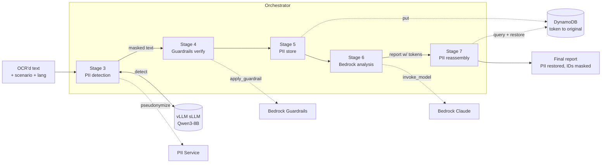

# Architecture

## Goal

Run AI analysis on financial documents **without ever exposing personal information
to the large language model**. PII is detected and masked first; the model sees only
anonymized text; then PII is restored deterministically in the final output.

## Pipeline

## Stages

| Stage | Where | What happens |
|-------|-------|--------------|
| 3 — PII detection | orchestrator + pii-service | A regex pass plus an sLLM (Qwen via vLLM) extract PII end-to-end. The pii-service `/pseudonymize` turns each value into a stable token (`[PERSON_1]`, `[SSN_1]`, …). If too many detection chunks fail, the pipeline aborts rather than risk leaking unmasked text. |
| 4 — Guardrails | pii-service | Amazon Bedrock Guardrails re-scans the masked text as a second line of defense. Non-fatal: passes through if unconfigured or on error. |
| 5 — PII store | pii-service | The token→original mapping is written to DynamoDB with a short TTL. |
| 6 — Bedrock analysis | orchestrator | Amazon Bedrock (Claude) analyzes the **anonymized** text and writes a report that keeps the PII tokens verbatim. |
| 7 — Reassembly | pii-service | Tokens in the report are replaced by their originals via deterministic string replacement. National IDs (RRN/SSN) are only **partially** restored — trailing digits stay masked. |

## Why "the large model never sees PII"

- Detection + masking (Stages 3–4) happen **before** any call to the large model.
- The large model (Stage 6) is invoked only on the masked/verified text.
- Restoration (Stage 7) is a pure string operation on the model's output, using the
  mapping stored in Stage 5 — the model is never involved in un-masking.

## Components

- **orchestrator** (`src/orchestrator`) — FastAPI service exposing `POST /pipeline/run`; runs Stages 3–7, calling the sLLM and Bedrock directly and the pii-service over HTTP.
- **pii-service** (`src/pii-service`) — FastAPI service with `/pseudonymize`, `/guardrails`, `/store`, `/reassemble`. CPU-only, no ML model dependency.
- **prompts** (`src/orchestrator/prompts.py`) — all language-specific assets (detection prompt, regex set, analysis prompt), keyed by `lang` (`ko` | `en`).

## Language support

The same Qwen sLLM serves both Korean and English (it is multilingual). The `lang`
parameter selects the detection prompt, regex supplement, and analysis prompt. The
Korean set detects RRN / Korean addresses; the English set detects SSN / US addresses.
